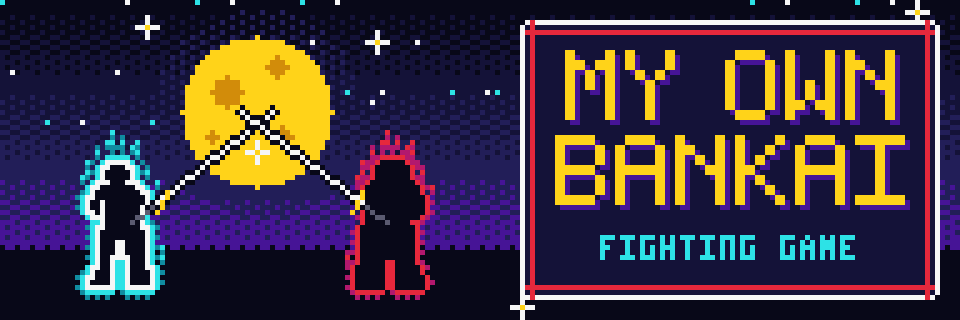

<p align="center">
  
</p>

# The Bleaches

A 3D fighting game in the spirit of *Bleach: Rebirth of Souls*, built around one idea: **a bankai should change how the opponent is able to fight, not just make numbers bigger.** Tensa Zangetsu makes the opponent's tracking lag behind. Konjiki Ashisogi Jizo's poison takes away their legs, then their arms. Enma Korogi takes away their senses. Each bankai also hits as hard as its strength in the story, and in bankai you control its abilities yourself.

Every character whose bankai appears in the manga is playable (22 in total).

## Play

Open `index.html` in a browser. There's no install and no build step (Three.js is bundled in `vendor/`). Play with a keyboard or an Xbox controller.

- **VS CPU**: you against a CPU opponent. The CPU's decisions are visibly disrupted by bankai, and its current thinking appears under its health bar.
- **Local 2 players**: two players on one keyboard. Here bankai disrupt human inputs, footing and visibility.

| | Move | Jump | Guard | Light | Heavy | Special | Dash | Bankai |
|---|---|---|---|---|---|---|---|---|
| Player 1 | A / D | W | S | F | G | H | R | T |
| Player 2 | ← / → | ↑ | ↓ | , | . | / | ; | ' |
| Xbox controller | Left stick / D-pad | A (or up) | LB / LT (or down), hold | X | Y | B | RB | RT |

**Xbox controller.** Plug in or pair the controller and press any button; the game shows "Controller connected". The first controller plays as P1 and a second one as P2 (with one controller in 2-player mode, P2 stays on the keyboard). The keyboard keeps working alongside it. The four bankai abilities are B, toward + B, away + B, and LB + B. Dash while being hit (RB) bursts free. The Menu (≡) button pauses; in menus use the stick or D-pad, A to confirm and B to go back. Controllers work when you open `index.html` directly in Chrome or Edge; some embedded views (such as the claude.ai preview) block controller access, and the title screen says so when that happens.

- **Bankai:** the reiatsu gauge fills as you fight. When it flashes **BANKAI READY**, release your bankai. It lasts until the gauge drains (about 20 seconds; some bankai are shorter). Using abilities burns bankai time.
- **Bankai abilities:** in bankai the special key does four different things. Press it on its own, while holding toward the opponent, while holding away from them, or while guarding. Each ability has its own cooldown, shown in the bar under your health. In shikai the special key has a single move.
- **Escaping combos:** each hit in a row stuns for less, so no string lasts forever. Buttons pressed in the last moments of being hit (about 0.13 s) still go through as soon as you recover. Dash while being hit to **burst** free; it costs 25 reiatsu and knocks the attacker back. Launched fighters are knocked down and can't be hit while getting up.
- **Traps:** in Gokei, Itodome, the burnt dead and the loom, mash attack buttons to break free.
- **Spirit orbs:** each fighter has two. Empty the health bar to shatter one; shatter both to win. Esc pauses.

## How bankai affect the opponent

Every input, from the keyboard or from the CPU, passes through the same status filter (`js/status.js`) before a fighter acts on it. A bankai can block actions, invert or delay inputs, take away traction or senses, and so on, and the rules are the same for humans and the CPU. Bankai abilities also deal damage over time (cold, nerve poison, disease, bleeding, the dark), and every bankai's damage is scaled by a power tier matching its strength in the story: Yamamoto, Ichigo, Kenpachi and Ichibe at the top, Ikkaku and Sasakibe at the bottom.

The CPU (`js/ai.js`) never reads bankai rules directly. It perceives the fight, sometimes wrongly (lagged tracking, chasing afterimages and clones, blindness). It notices when its own actions fail, learns from what happens to it (guarding is useless against Kenpachi, hitting Shunsui in his first act hurts itself), and reacts to what it can see (telegraphed strikes, the lock-on reticle, poison clouds, Yamamoto's flame armour). It uses all four of its own bankai abilities and bursts out of long combos.

| Character | Bankai | What it does |
|---|---|---|
| Ichigo Kurosaki | True Tensa Zangetsu | The reforged twin blades from the war with Yhwach. Power compressed into speed: flash steps leave afterimages and the opponent tracks where he was, so their turns and guard lag behind him. When the bankai breaks, the shell crumbles to reveal the original blade for one final strike. |
| Byakuya Kuchiki | Senbonzakura Kageyoshi | A million blades. They shred incoming projectiles on their own and drift as clouds that cut and slow anyone inside. Senkei walls the opponent in with rows of swords, Gokei crushes whoever a cloud holds, and Shukei: Hakuteiken gathers every petal into one white blade. |
| Toshiro Hitsugaya | Daiguren Hyorinmaru | The battlefield turns to ice. The opponent loses traction and slides, and every hit builds frost that slows their body and burns with cold until they freeze solid. Ryusenka impales in ice, Sennen Hyoro crushes them in a prison of pillars. |
| Mayuri Kurotsuchi | Konjiki Ashisogi Jizo | A giant golden Jizo crawls after the opponent breathing nerve poison. As it builds they lose jumping, then dashing, then their arms, then everything, and the poison eats at them the whole time. He can reformulate it to work twice as fast. |
| Renji Abarai | Soo Zabimaru | Higa Zekko: floating fangs pen the opponent into a narrow cage they cannot walk out of, then snap shut, and no guard covers that. They can only tear out with a dash, and the fangs bite. Hikotsu Taiho fires a bone cannon; the baboon arm grabs and throws. |
| Rukia Kuchiki | Hakka no Togame | She becomes absolute zero. Inside her white mist every movement builds frost, so the opponent must hold still or creep, and striking her body freezes the attacker. Her dances are hers to call: Tsukishiro, Hakuren and Shirafune. |
| Kenpachi Zaraki | Nameless Bankai | His body turns demonic and his swings cut through anything: blocking is useless and hits do not stagger him. The opponent has to stop guarding and start evading. His roar freezes them in place. (The bankai's name was never revealed.) |
| Shunsui Kyoraku | Katen Kyokotsu: Karamatsu Shinju | A tragic play in four acts, staged at his command. The first act shares wounds, so hitting him is self-harm. The second spreads black spots of incurable disease. In the third the opponent drowns and their reiatsu drains away. The final act, Itodome, strangles with thread. |
| Genryusai Yamamoto | Zanka no Tachi | Every flame folds into the blade and the air around him scorches. Its four aspects are his to call: East, Kyokujitsujin, an edge that incinerates; West, Zanjitsu Gokui, armour of fifteen-million-degree flame; South, Kaka Jumanokushi, the burnt dead rising to hold you; North, Tenchi Kaijin, one slash that erases everything in front of him. |
| Soi Fon | Jakuho Raikoben | A missile launcher bolted to her arm. A lock-on reticle stalks the opponent, and the longer they stay inside it the bigger the blast, so they can never stop moving. Shunko wraps her in lightning; Suzumebachi still kills in two stings. |
| Sajin Komamura | Kokujo Tengen Myo-o | A colossal armoured giant mirrors his swings across the whole arena. Its shadow marks where the blade will land and the opponent has to read it and get out from under it. Its sweep must be jumped, its fist pounds from above, and its armour can wrap Komamura himself. |
| Retsu Unohana | Minazuki | Her cuts bleed, and they bleed faster the harder the victim exerts themselves, so the opponent has to stop running and dashing while she heals from every wound she opens. Blood rains from above, and the first Kenpachi's swordsmanship comes back in a flurry. |
| Gin Ichimaru | Kamishini no Yari | A blade that crosses the whole arena in an instant, so keeping distance is pointless. A hit leaves a sliver inside that he can dissolve at will with Korose. The opponent must rush him and keep him busy. |
| Kaname Tosen | Suzumushi Tsuishiki: Enma Korogi | A dome that strips away sight, hearing, smell and spiritual sense, and wears the victim down while it does. Inside it the opponent can't see him or turn to face him and has to guess from the sound of his blade. Benihiko rains blades; the silent step puts him behind them. |
| Shinji Hirako | Sakashima Yokoshima Happofusagari | An inverted world. Left and right swap for the opponent, and so do up and down (jump and guard); any swing that finds nothing cuts the swinger. Just as they adapt, Shinji flips it back. Decoys draw their attacks, and his strikes arrive from the side they aren't facing. |
| Rojuro Otoribashi | Kinshara Butodan | An orchestra of music-driven illusions real enough to wound. Golden phantoms fly at the opponent alongside the real attacks and look identical (only the real ones cast a shadow). He conducts the programs: Prometheus engulfs them in flame, Sea Drift drowns them in a whirlpool, and Ein Heldenleben strikes anyone who doesn't cover their ears. |
| Kensei Muguruma | Tekken Tachikaze | Brass knuckles that hit with shockwaves. Every blow concusses: the opponent's inputs arrive late, so their timing, blocks and escapes all lag a beat behind. Barrages, uppercuts and a ground punch that must be jumped. |
| Ikkaku Madarame | Ryumon Hozukimaru | Three giant blades and a dragon crest that fills red with every clash, hits given and taken alike, until his strength doubles. Trading blows feeds him, so the opponent has to disengage and wait it out. He can throw the crescent blade or roar to fill the crest. |
| Chojiro Sasakibe | Koko Gonryo Rikyu | He commands the lightning of the whole sky. Anyone who leaves the ground is struck, so the opponent loses jumping entirely, and bolts keep raining on marked ground across the arena. He can call a bolt down on them or charge the air around himself. |
| Kisuke Urahara | Kannonbiraki Benihime Aratame | Restructures whatever it touches. A hit tears down an active bankai, or else seals one of the opponent's tools (light or heavy attacks, special, dash or jump) and the rewrite hurts. Chikasumi no Tate throws up a shield, and he can restructure his own wounds. |
| Ichibe Hyosube | Shirafude Ichimonji | Ink that blots out names and a brush that writes new ones. Each white stroke erases one of the opponent's abilities for the rest of the bankai (special, then dash, then jump) and the loss of a name hurts. His brush can rename them into something weak, and Futen Taisatsuryo brings down a great blast. |
| Senjumaru Shutara | Shatatsu Karagara Shigarami no Tsuji | A great loom weaves threads through the arena. Brushing one snares the opponent, so they have to pick their way through the gaps. She can re-weave the lattice tight around them, pull them across it, or wrap them where they stand. |

### Bankai abilities

| Character | Bankai | Abilities |
|---|---|---|
| Ichigo Kurosaki | True Tensa Zangetsu | **H** Getsuga Tensho<br>**→ + H** Getsuga Jujisho<br>**← + H** Afterimage Clone<br>**S + H** Tensa Rush |
| Byakuya Kuchiki | Senbonzakura Kageyoshi | **H** Kageyoshi<br>**→ + H** Shukei<br>**← + H** Senkei<br>**S + H** Gokei |
| Toshiro Hitsugaya | Daiguren Hyorinmaru | **H** Hyoten Hyakkaso<br>**→ + H** Ryusenka<br>**← + H** Sennen Hyoro<br>**S + H** Guncho Tsurara |
| Mayuri Kurotsuchi | Konjiki Ashisogi Jizo | **H** Jizo Lunge<br>**→ + H** Poison Breath<br>**← + H** Reformulated Poison<br>**S + H** Ashisogi Jizo |
| Renji Abarai | Soo Zabimaru | **H** Higa Zekko<br>**→ + H** Hikotsu Taiho<br>**← + H** Snake Lash<br>**S + H** Baboon King's Arm |
| Rukia Kuchiki | Hakka no Togame | **H** Hakka no Togame<br>**→ + H** Some no mai<br>**← + H** Tsugi no mai<br>**S + H** San no mai |
| Kenpachi Zaraki | Nameless Bankai | **H** Cleave<br>**→ + H** Two-Handed Kendo Slash<br>**← + H** Roar<br>**S + H** Ground Smash |
| Shunsui Kyoraku | Katen Kyokotsu: Karamatsu Shinju | **H** Final Act<br>**→ + H** First Act<br>**← + H** Second Act<br>**S + H** Third Act |
| Genryusai Yamamoto | Zanka no Tachi | **H** North<br>**→ + H** East<br>**← + H** West<br>**S + H** South |
| Soi Fon | Jakuho Raikoben | **H** Jakuho Raikoben<br>**→ + H** Shunko<br>**← + H** Nigeki Kessatsu<br>**S + H** Shunko Burst |
| Sajin Komamura | Kokujo Tengen Myo-o | **H** Myo-o's Slam<br>**→ + H** Myo-o's Sweep<br>**← + H** Myo-o's Armour<br>**S + H** Myo-o's Fist |
| Retsu Unohana | Minazuki | **H** Minazuki<br>**→ + H** Blood Rain<br>**← + H** Restoration<br>**S + H** First Kenpachi's Flurry |
| Gin Ichimaru | Kamishini no Yari | **H** Kamishini no Yari<br>**→ + H** Korose<br>**← + H** Buto Renjin<br>**S + H** Wide Sweep |
| Kaname Tosen | Suzumushi Tsuishiki: Enma Korogi | **H** Enma Korogi<br>**→ + H** Suzumushi Nishiki<br>**← + H** Suzumushi<br>**S + H** Silent Step |
| Shinji Hirako | Sakashima Yokoshima Happofusagari | **H** Flip<br>**→ + H** Sakanade<br>**← + H** Inverted Strike<br>**S + H** Happofusagari Decoys |
| Rojuro Otoribashi | Kinshara Butodan | **H** Grand Finale<br>**→ + H** Program<br>**← + H** Program<br>**S + H** Ein Heldenleben |
| Kensei Muguruma | Tekken Tachikaze | **H** Shockwave<br>**→ + H** Tekken Barrage<br>**← + H** Uppercut<br>**S + H** Ground Punch |
| Ikkaku Madarame | Ryumon Hozukimaru | **H** Spin<br>**→ + H** Crescent Throw<br>**← + H** Crest Charge<br>**S + H** Overhead Smash |
| Chojiro Sasakibe | Koko Gonryo Rikyu | **H** Thunderstorm<br>**→ + H** Lightning Thrust<br>**← + H** Lightning Field<br>**S + H** Heaven's Bolt |
| Kisuke Urahara | Kannonbiraki Benihime Aratame | **H** Nake, Benihime<br>**→ + H** Benihime Aratame<br>**← + H** Chikasumi no Tate<br>**S + H** Restructure Self |
| Ichibe Hyosube | Shirafude Ichimonji | **H** Shirafude Ichimonji<br>**→ + H** Ichimonji<br>**← + H** Rename<br>**S + H** Futen Taisatsuryo |
| Senjumaru Shutara | Shatatsu Karagara Shigarami no Tsuji | **H** Re-weave<br>**→ + H** Needle Volley<br>**← + H** Thread Pull<br>**S + H** Binding Wrap |

Only bankai shown in the manga are included. Bankai that appear only in the novels or in anime filler are not.

## Code layout

| File | Purpose |
|---|---|
| `js/core.js` | Constants and helpers |
| `js/status.js` | Status effects, the intent filter, damage over time |
| `js/fighter.js` | Movement, attacks, frame data, bankai abilities, combo escape |
| `js/characters.js` | The roster: each shikai special, bankai rule and four abilities |
| `js/world.js` | Match simulation: hits, projectiles, zones, telegraphed strikes, summons |
| `js/ai.js` | CPU opponent |
| `js/gamepad.js` | Xbox / standard controllers through the Gamepad API |
| `js/look.js` | How each fighter looks and is posed |
| `js/scene3d.js` | Three.js scene: arena, toon-shaded models, camera, bankai effects |
| `js/hud.js` | 2D overlay: HUD, ability cooldowns, callouts, banners |
| `js/main.js` | Menus, keyboard input, main loop |

The simulation is a side-on 2D plane; `scene3d.js` maps it into 3D. Everything except `scene3d.js`, `hud.js` and `main.js` is pure logic that runs headless.

## Tests

```sh
node --test tests/sim.test.js                          # bankai effects, abilities, combo escape, CPU adaptation, full CPU-vs-CPU matches
NODE_PATH=$(npm root -g) node tests/smoke.js shots/    # headless Chromium: menus, a fight, every bankai in 3D; saves screenshots
```

The smoke test needs Playwright with Chromium available.

Three.js r128 is included under the MIT licence (`vendor/three.LICENSE`).
